# Tempus

Tempus is an all-in-one productivity app built based on user feedback for Android and web, using a Flutter front-end and Firebase back-end. Included are tasks, goals, notes, and a pomodoro timer. See below for an overview of each.

**Web Version:**
https://tempus-76e80.web.app/

**Google Play:** Coming soon

# Features

The current feature list can be found by unfolding the following sections. Further features are being considered and may be added in the future.

    
<b>Login</b>
 
    Both Google and SMS authentication is supported. 
    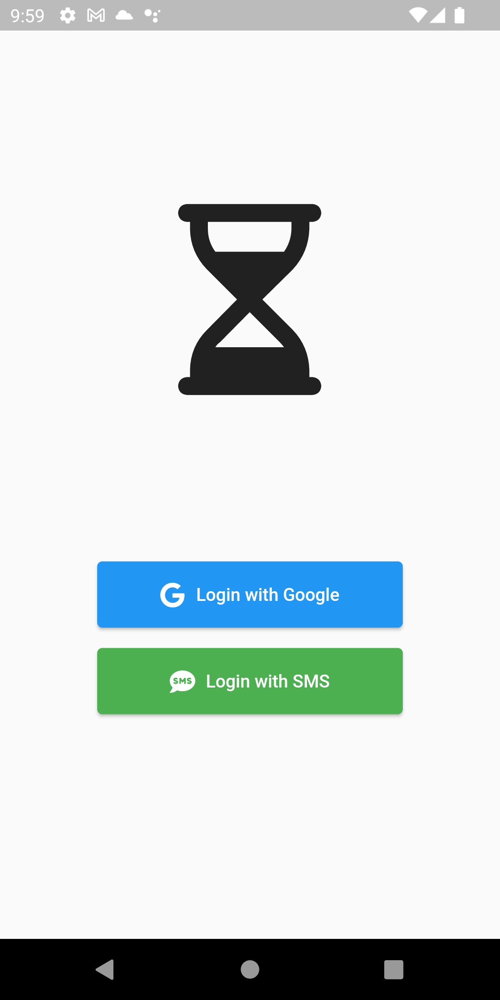

    
<b>Home</b>
 
    The home screen displays the logged in user, an overview of task and goal progress, and an open-ended "sticky note" that persists through dates. Home also provides access to the theme settings page which includes colour and dark mode options. 
    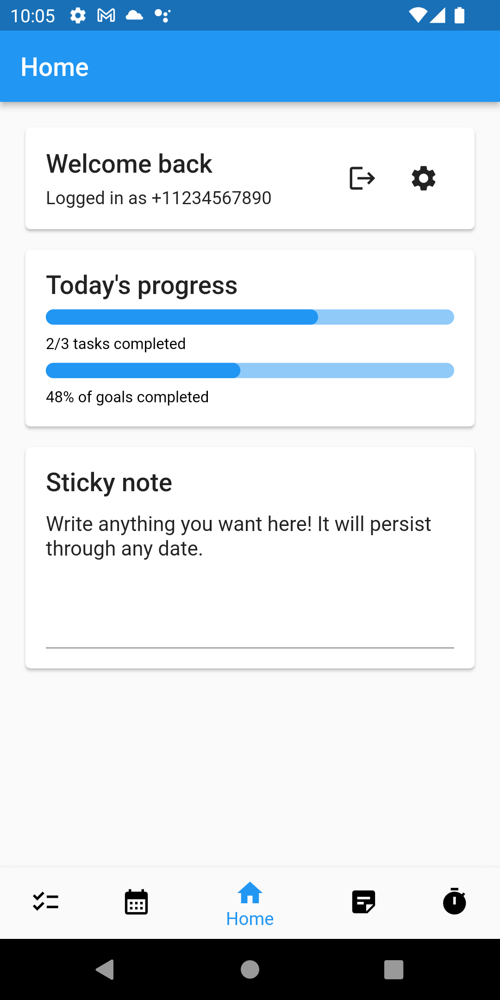
    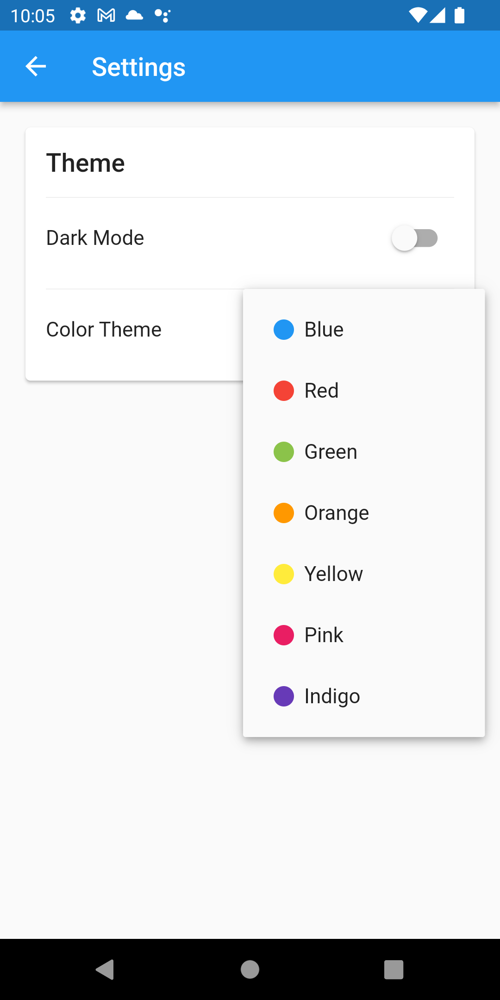
    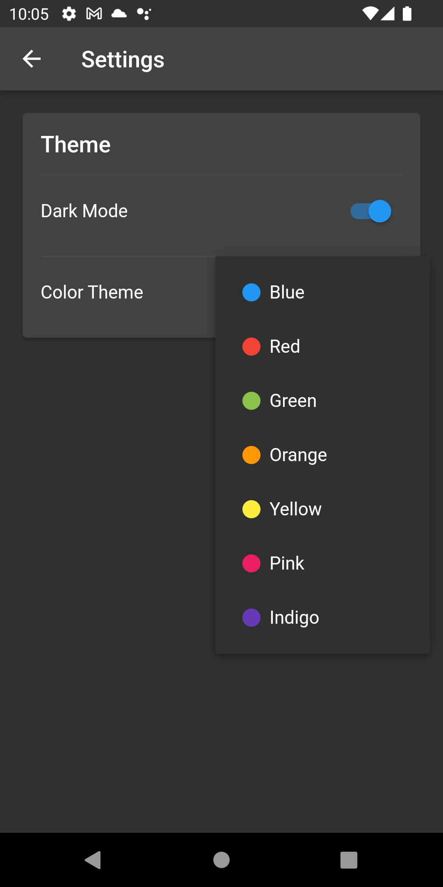

    
<b>Tasks</b>
 
    The tasks page provides a simple daily todo list. Use the action buttons to sort tasks by completion or add incomplete tasks from the previous day. 
    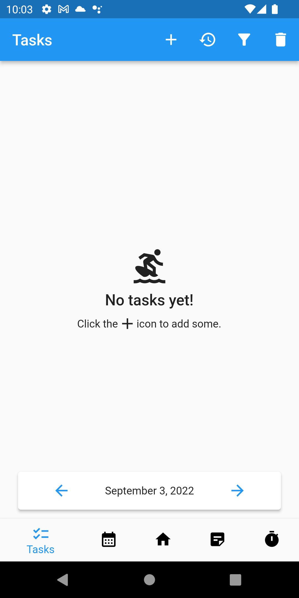
    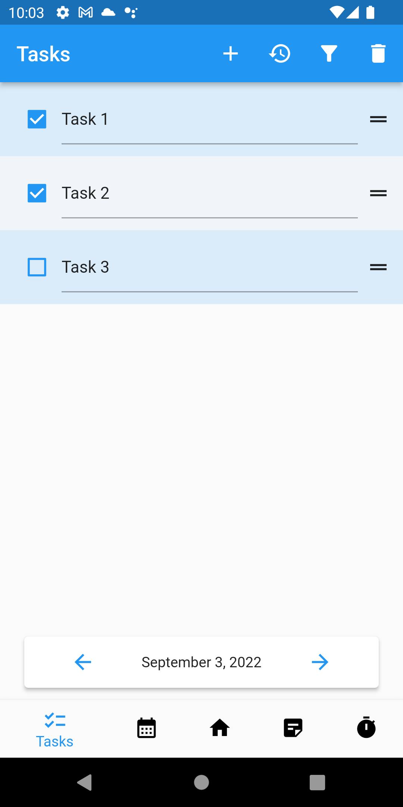
    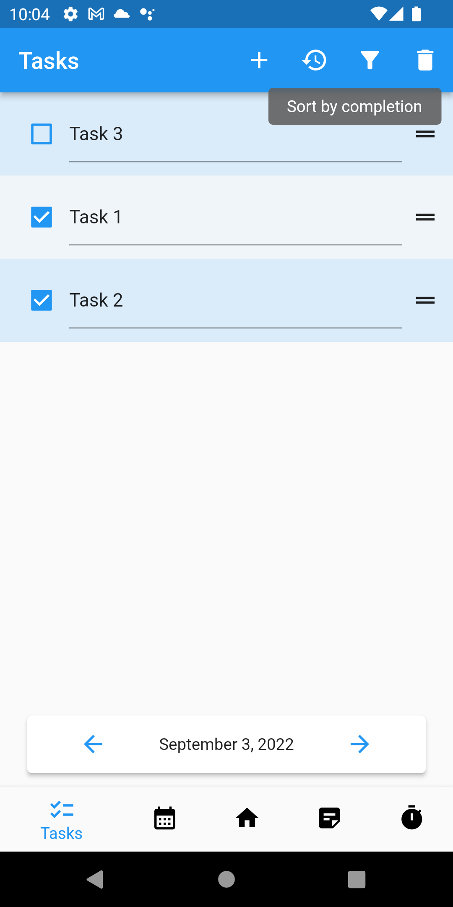
    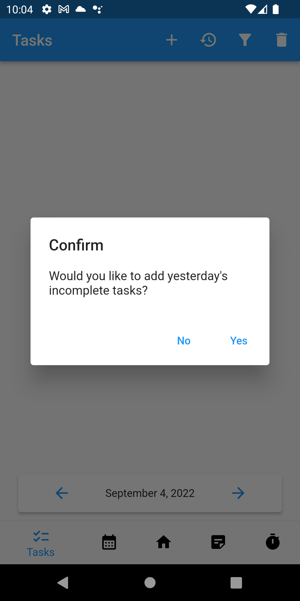
    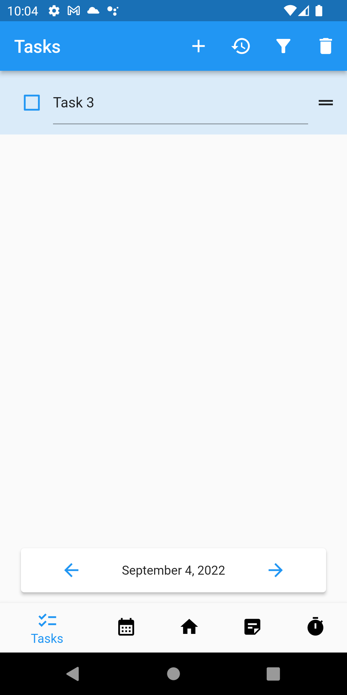

    
<b>Goals</b>
 
    The goals page attempts to provide a minimally restrictive framework for daily goals. The added goals are not unique to the date but the slider progress is. 
    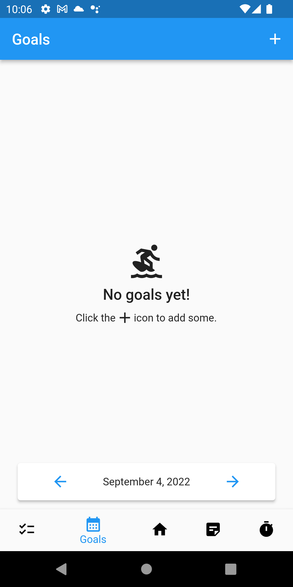
    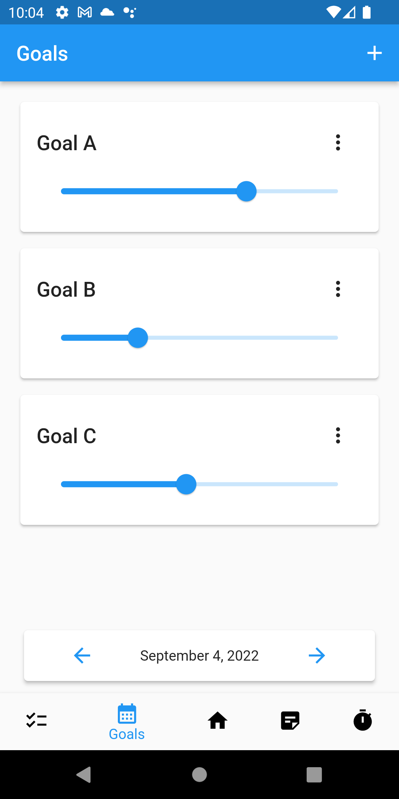

    
<b>Notes</b>
 
    The notes page consists of user added sections, each with a unique title and body, to support various use cases. For convenience, sections from previous dates can be easily copied to the current date. 
    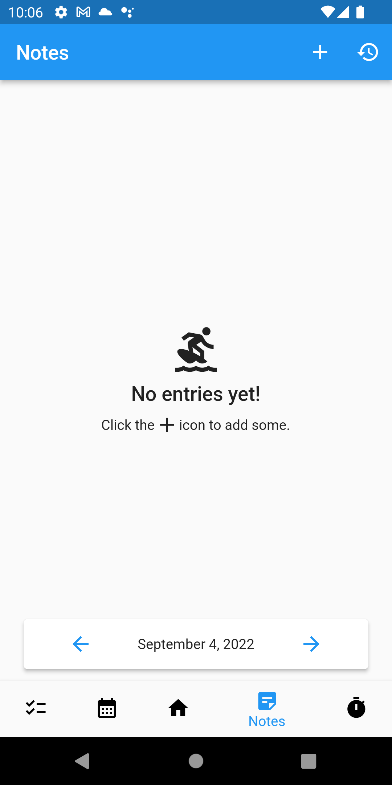
    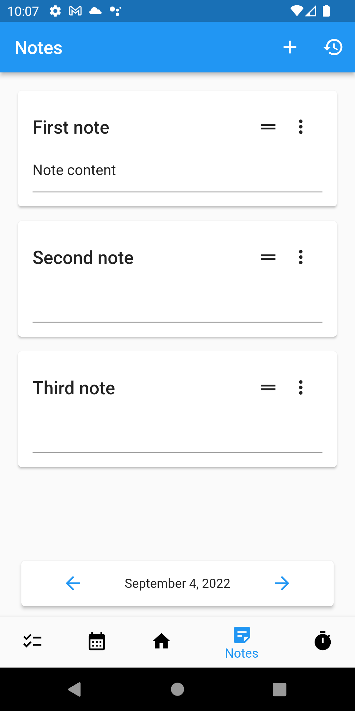
    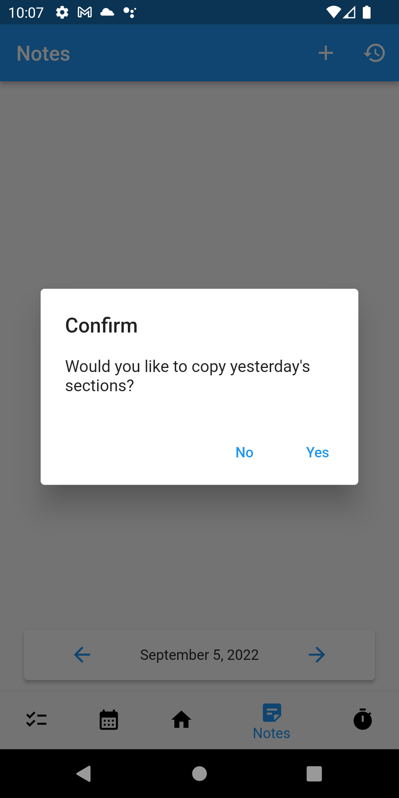
    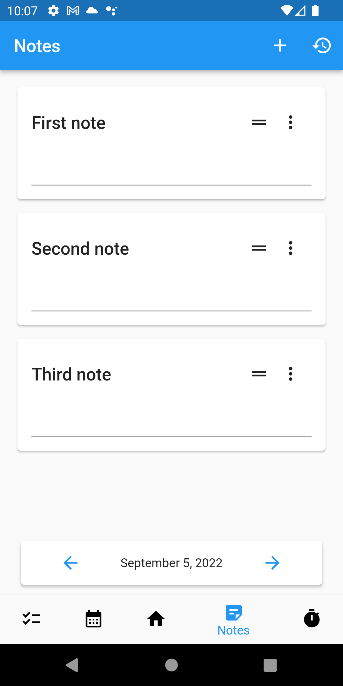

    
<b>Pomodoro</b>
 
    The pomodoro page is a virtual implementation of the increasingly popular [Pomodoro Technique](https://en.wikipedia.org/wiki/Pomodoro_Technique) for time management. The timer sound and duration can be configured extensively through the settings page. 
    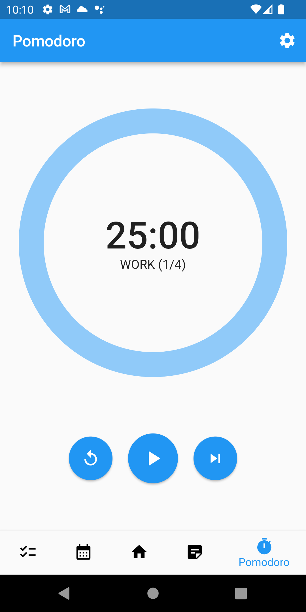
    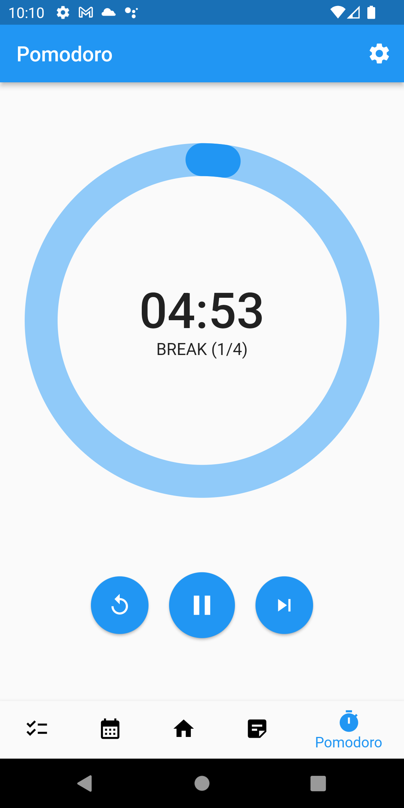
    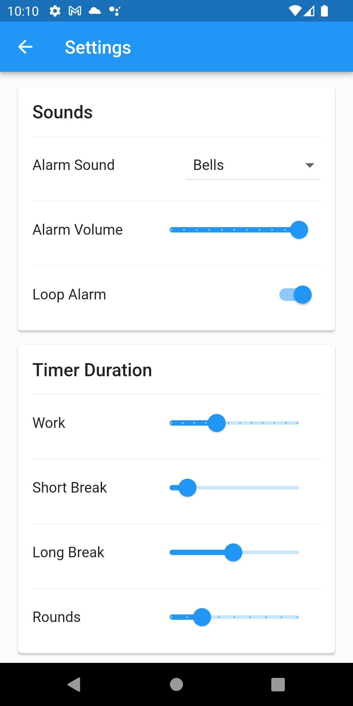

